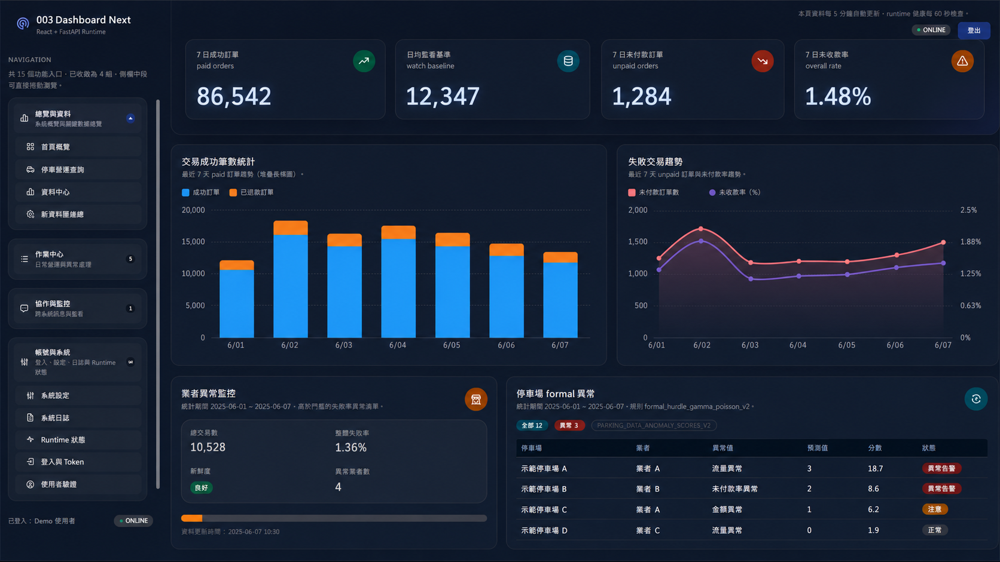
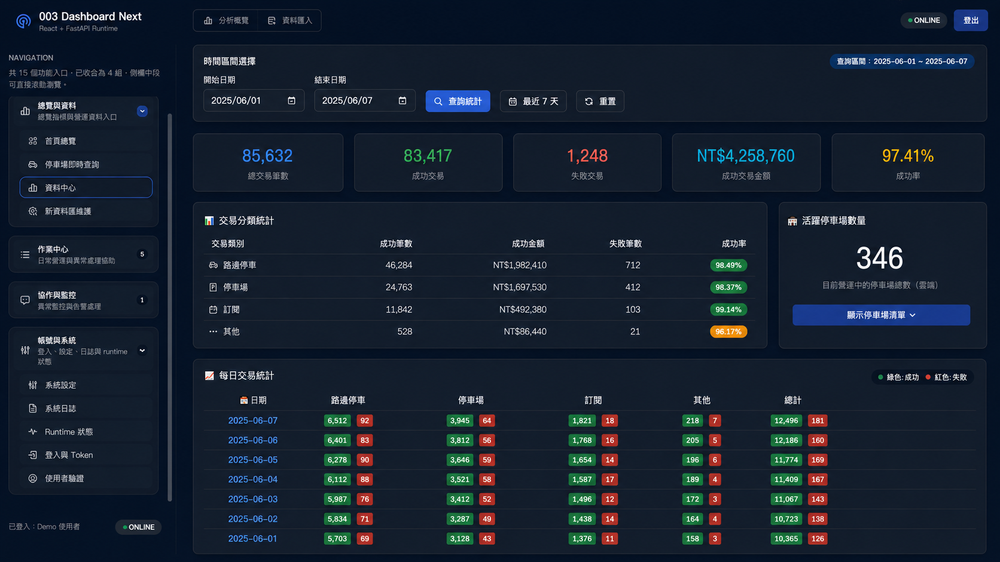
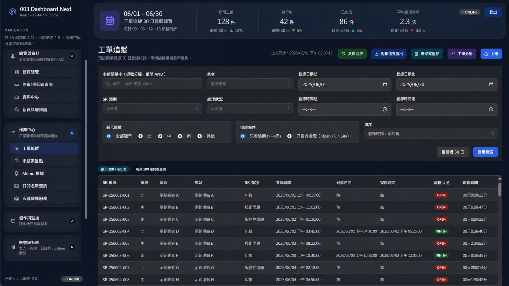
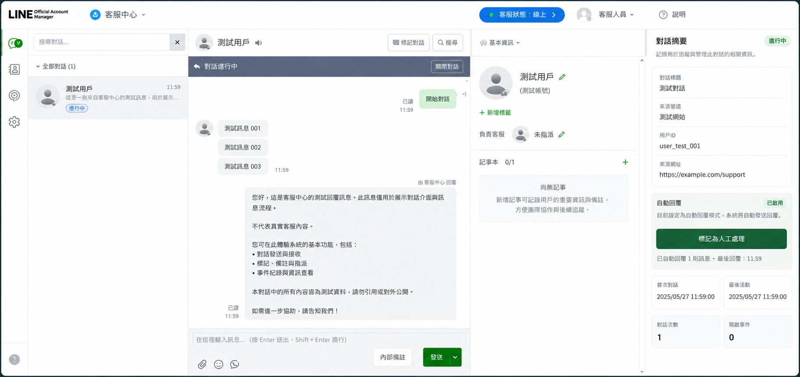
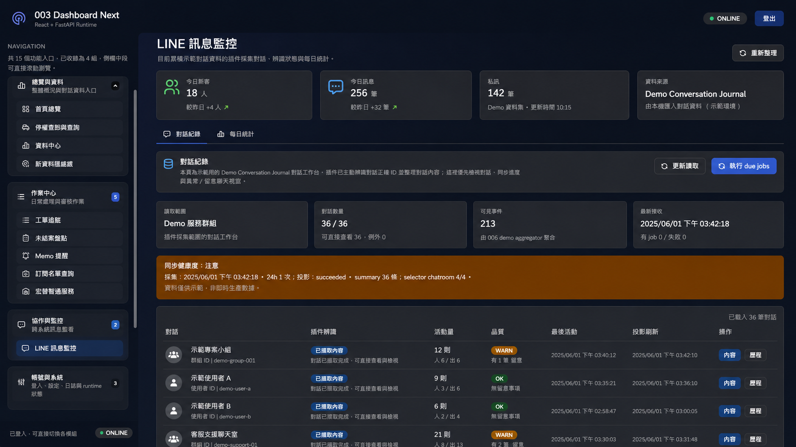
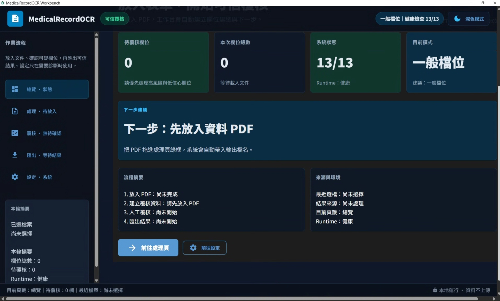
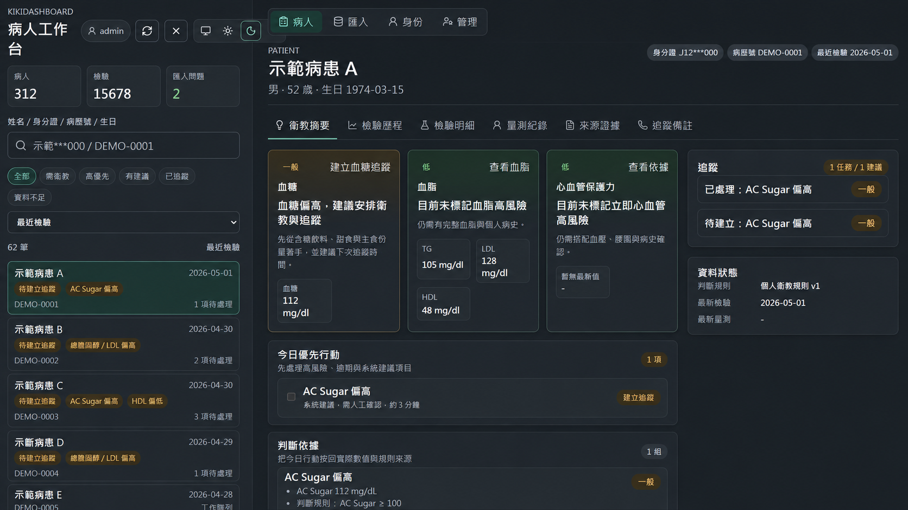

# 李威揚 — 客服營運管理作品集

> 具備多年客服營運與團隊管理經驗，擅長識別現場問題、拆解流程需求，並運用 Excel、Google Sheets、SQL、Python 與 AI 輔助工具，將重複性查詢、報表整理、工單追蹤與營運監控流程**工具化**。
>
> 我的定位不是開發工程師，而是能讓工具真正服務管理需求的**管理型人才**。

> 說明：本作品集僅展示脫敏後的畫面、問題背景與功能設計；原始碼、真實營運資料與內部設定不公開。

---

## 📂 作品索引

| # | 專案名稱 | 核心能力 | 說明 |
|---|----------|----------|------|
| 003 | [客服營運監控 Dashboard](#003-客服營運監控-dashboard) | 數據可視化 / 後端整合 | 自動彙整多來源數據，即時呈現客服 KPI |
| 004 | [LINE 客服訊息資料化工具](#004-line-客服訊息資料化工具) | 訊息接收 / 同步保存 / 回溯監控 | 接收、同步與保存 LINE 官方帳號訊息，支援後續客服回溯與營運監控 |
| 005 | [醫療表單電子化與人工覆核工具](#005-醫療表單電子化與人工覆核工具) | OCR 流程電子化 / 人工覆核 / 規則標記 | 將固定格式表單轉為可覆核的結構化資料，輔助後續人工追蹤與資料整理 |

> 📌 更多專案持續更新中

---

## 003 客服營運監控 Dashboard

### 💡 背景與問題

客服團隊每日需要跨系統（Excel 報表、工單平台、外部 API）手動彙整數據，製作日報、週報耗時且容易出錯，主管難以即時掌握團隊狀況與異常。

過去每一份週報至少需要一小時準備；日報即便加快作業，通常也要二到三十分鐘。數據分散在不同系統，彙整的時間成本遠高於資訊本身的價值。

### 🔧 解法

自行設計並建置一套以 **Python FastAPI + React** 為核心的客服營運監控平台，整合多個數據來源，透過排程自動同步，提供即時可視化看板。

現在隨時打開儀表板就有即時數據，不再需要固定排程手動製作報表。目前儀表板的使用者在八人以內，涵蓋第一線客服同仁與直屬主管——主管直接要求開通存取權限，需要了解團隊狀況時自行查看，減少對人工匯報的依賴。

**主要功能：**
- 📊 KPI 即時總覽（工單量、處理時效、異常率）
- 📁 Excel 自動匯入與解析（支援多格式、欄位對應設定）
- 🔄 排程自動同步外部系統數據
- 📬 信箱自動抓取附件並觸發匯入流程
- 📤 支援多格式匯出（Excel / CSV / JSON）
- 🔐 JWT 身份驗證 + 審計日誌

**異常偵測機制：**

系統內建兩套異常監控邏輯，分別對應不同業務場景：

1. **下游代理廠商數據異常追蹤**：針對每家代理廠商的每日交易數量建立長期基準，結合歷史均值與節假日因子推算預期區間。一旦實際數據偏離合理範圍，通常在三天內即可識別出異常，避免問題發酵後才被動發現。

2. **設備叫修 SLA 追蹤**：部分設備維修有嚴格時效限制（一般規定五天內，部分業者更要求 36 小時內完成）。系統支援自訂閾值，在時效即將超限前主動發出告警通知，讓工程師能提前介入而非等到逾期。

**技術組成：**
`Python` `FastAPI` `PostgreSQL` `React` `SQLAlchemy` `APScheduler` `IMAP`

### 📸 畫面截圖

---

## 004 LINE 客服訊息資料化工具

### 💡 背景與問題

客服團隊透過 LINE 官方帳號與群組接收大量訊息，但訊息若只停留在即時對話介面，後續容易出現回溯困難、查詢分散、統計不易與高頻問題難以整理等狀況。當本機服務或人員作業中斷時，也需要避免訊息遺漏，確保資料能被保存與追蹤。

這套系統服務的客戶群體屬於高密度互動型態：單一客服人員每天對應的客戶數約在四十位上下，客戶數量雖然不算龐大，但每位客戶的問題複雜度高、佔用客服時間長。訊息若無法系統性地留存與分析，很難真正理解客服互動的全貌。

### 🔧 解法

建置 LINE 訊息接收、同步與保存流程，以 LINE Webhook 作為入口，將訊息落地至本機 PostgreSQL，並保留 JSONL 備援與 Cloudflare Workers / D1 雲端緩衝機制。

在訊息資料化的基礎上，進一步引入**本機端 AI 語義分析**：於辦公室本地部署 llama.cpp 搭配 Gemma 4 E4B 模型，對累積的對話內容進行語義理解，自動彙整成客服報表，提供產品開發端參考。

這套分析流程的目標不在於減少訊息遺漏或加快回覆速度，而是讓管理者真正看清楚：**客服人員如何與用戶互動**、高頻問題集中在哪、哪些情境容易造成溝通成本上升。模型的選擇目前受限於本機硬體，若硬體條件允許，可導入能力更強的模型進一步提升分析品質。

**主要功能：**
- 💬 LINE Webhook 訊息接收與本機資料庫保存
- 🧾 多帳號 / 群組訊息紀錄與查詢基礎
- 🔁 Cloudflare Workers / D1 雲端接收緩衝與本機同步
- 🗂️ JSONL 備援、歷史回填與同步狀態追蹤
- 🧹 訊息去重、同步確認與維運查詢端點
- 🤖 本機 AI 語義分析，自動彙整對話內容為客服報表
- 📊 可供 Dashboard 或後續分析流程讀取，支援客服回溯與訊息量觀察

**技術組成：**
`Python` `Flask` `LINE Messaging API` `PostgreSQL` `Cloudflare Workers / D1` `JSONL` `llama.cpp` `Gemma 4`

### 📸 畫面截圖

---

## 005 醫療表單電子化與人工覆核工具

### 💡 背景與問題

部分醫療或健檢流程仍仰賴固定格式紙本表單與人工輸入，資料整理耗時且容易產生輸入錯誤。即使完成 OCR 辨識，也不能直接視為正式資料，仍需要人工覆核、欄位確認與後續整理流程，才能降低錯誤風險並支援後續追蹤作業。

過去個管師要查閱一位病人的完整資料，需要分別登入至少三個後台系統——其中一個還必須透過受管制的 VPN 才能存取，光是資料彙整的前置作業就已消耗大量時間與精神。

### 🔧 解法

建置本機端 **MedicalRecordOCR Workbench**，將固定格式表單轉為可覆核的結構化資料。系統採取 trust-first / review-first 思路：OCR 結果只作為候選證據，正式匯出前仍需人工確認高風險或不確定欄位。後續資料可匯出為 JSON / CSV / Excel，或再匯入本機資料庫，供人工追蹤、資料整理與規則標記使用。

目前已在一家婦產科診所實際試行，累積病患數量已達數百人且持續增加。系統將衛教提醒與檢測管控流程完全自動化，但保留個管師的專業判斷介入點——目的是降低個管師在**專業判斷以外**的行政負擔，而非取代其臨床專業。個管師現在只需要開啟一個整合平台，即可看到過去散落在三個獨立系統的完整病人資料。

原本一份表單的人工處理約需五到十分鐘；導入 OCR 後，系統可以放一台電腦先自動跑，事後只需安排一到兩人進行覆核，人力得以集中在與病患的高品質互動上。

**主要功能：**
- 📝 固定格式表單 OCR 電子化與欄位抽取
- ✅ 人工覆核流程，避免 OCR 結果直接成為正式資料
- 📤 支援 JSON / CSV / Excel 匯出，便於後續整理與交付
- 📥 可透過 CSV / API 匯入本機資料庫，延伸為追蹤資料來源
- 🏷️ 以規則標記輔助人工追蹤、待確認項目與例外狀況整理
- 📊 提供工作台介面，協助查看欄位結果、覆核狀態與資料整理進度
- 🔗 整合多後台資料來源，個管師透過單一平台即可查閱完整病人資料

**技術組成：**
`Python` `PostgreSQL` `OCR` `CSV / API 匯入` `規則標記` `Dashboard UI`

### 📸 畫面截圖

### 📎 補充說明

這個作品的重點不是以系統取代醫療判斷，而是把固定格式文件處理、人工覆核、資料匯出與後續追蹤輔助流程串成可操作的工作台。系統輸出作為資料整理與人工追蹤參考，仍需由實際業務人員或專業人員確認後使用。

---

## 🛠️ 工具能力概覽

| 類別 | 工具 / 技術 |
|------|-------------|
| 語言 | Python、SQL、TypeScript、Go（少量使用） |
| 後端 | FastAPI、Flask |
| 前端 | React、TypeScript、HTML/CSS |
| 資料庫 | PostgreSQL、MySQL（現以 PostgreSQL 為主）、SQLite |
| 自動化 | APScheduler、IMAP 信箱整合、Excel 批次處理 |
| AI 工具 | Gemini API、GPT、Grok、GitHub Copilot、Claude、llama.cpp（本機推論） |
| 管理工具 | Excel、Google Sheets |

---

## 📬 聯絡方式

如有職缺洽詢或合作機會，歡迎透過 GitHub Issues 或直接聯繫。
